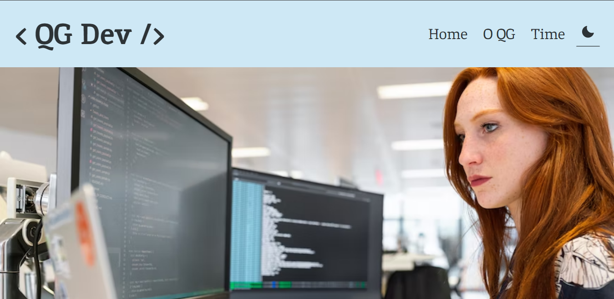

# < QG Dev />

Projeto pessoal desenvolvido com o objetivo de contuinuar me desafiando com a criação de aplicações cada vez mais complexas. O foco do projeto foi a utilização dos tema Light e Dark de forma otimizada, criando uma aplicação responsiva com diferentes temas.
Todas as imagens utlizadas foram retiradas do Unsplash.

## 🔧 Tecnologias Utilizadas

- JSX
- Javascript
- React
- Styled Components
- Context API
- Phosphor React
- React Router DOM

## 🔗 Deploy

Para visitar o < QG Dev /> basta <a href="https://qg-dev.vercel.app/">clicar aqui</a>!

## 📱 Demo

| Desktop Version |
|----------------|
|  |
